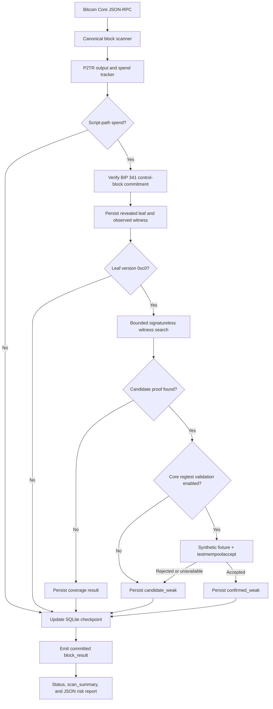
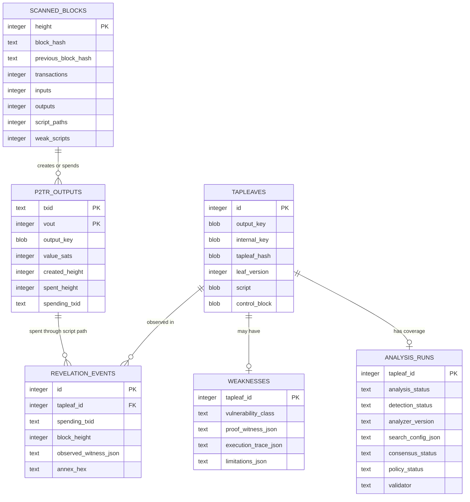

# Architecture

## Design goals

The scanner is designed to be:

- **read-only** with respect to Bitcoin;
- **evidence-based**, retaining the revealed script and commitment proof data;
- **resumable**, committing one block at a time;
- **reorganization-aware**, so its local view follows the canonical chain;
- **bounded**, avoiding claims that exceed the analyzer's search space;
- **auditable**, returning a witness and execution trace for each candidate.

It is not designed to be a wallet, transaction builder, mempool bot, or
automated fund-rescue system.

## End-to-end flow



## Module responsibilities

| Module | Responsibility |
| --- | --- |
| `src/main.rs` | CLI parsing, authentication selection, command dispatch, and JSON output. |
| `src/rpc.rs` | Blocking Bitcoin Core JSON-RPC client and exact BTC-to-satoshi decoding. |
| `src/scanner.rs` | Scan-range validation, canonical iteration, interruption handling, resume, and reorganization reconciliation. |
| `src/taproot.rs` | P2TR detection, annex and control-block parsing, tagged hashes, and output-key verification. |
| `src/analyzer.rs` | TapScript parsing, bounded witness generation, partial execution, classification, and tracing. |
| `src/core_validator.rs` | Temporary isolated regtest lifecycle, synthetic fixture construction, candidate serialization, and Bitcoin Core validation. |
| `src/detection.rs` | Detection, consensus, and policy evidence states plus the validator boundary. |
| `src/db.rs` | SQLite schema, block-atomic persistence, local P2TR UTXO state, rollback, status, and risk reporting. |
| `src/progress.rs` | Per-committed-block text/NDJSON events, run totals, and interactive progress bars. |

## Scan lifecycle

### 1. Node and range validation

The scanner calls `getblockchaininfo` to obtain:

- chain name;
- current block height;
- pruning status.

A non-pruned node is currently required. The target height defaults to a
snapshot of the node tip taken at startup and cannot exceed it. The target is
not advanced during the run; reaching it is a normal terminal condition.

The default Taproot activation heights are:

| Chain | Height |
| --- | ---: |
| mainnet (`main`) | 709632 |
| testnet3 (`test`) | 2011968 |
| signet | 0 |
| regtest | 0 |
| testnet4 | 0 |

They can be overridden for controlled testing.

### 2. Durable scan identity

On the first run, SQLite records:

- chain;
- start height;
- next height;
- target height;
- Taproot activation height.

Later runs must use the same chain, start height, and activation height. The
target height may be advanced.

### 3. In-memory P2TR UTXO index

At startup, currently unspent rows from `p2tr_outputs` are loaded into a hash
map keyed by outpoint. This makes input matching inexpensive while blocks are
processed.

For each transaction:

1. Inputs are checked against the P2TR UTXO index.
2. Matching inputs mark the stored output as spent.
3. Script-path witnesses are parsed and verified after activation.
4. New P2TR outputs are inserted into SQLite and the in-memory index.

Processing inputs before outputs is compatible with Bitcoin's block transaction
ordering and supports spends of outputs created by earlier transactions in the
same block.

### 4. Per-block atomicity

All database changes for a block are committed in one SQLite transaction:

- spent-output updates;
- created P2TR outputs;
- revealed leaves;
- revelation events;
- candidate weaknesses;
- aggregate counts;
- next-height checkpoint;
- last block hash.

Complete block and transaction RPC responses are never stored.

An interruption between blocks leaves the last committed checkpoint resumable.
The corresponding `block_result` is emitted only after that block transaction
commits, so every printed height is a durable resume boundary.

### 5. Reorganization reconciliation

Before resuming, the scanner compares stored block hashes with the node's
canonical hashes and first identifies the common ancestor without changing the
database. RPC transport, authentication, timeout, and server errors abort
reconciliation without authorizing rollback.

Spent P2TR rows are retained only for the configured rollback window, 144
blocks by default. If the common ancestor would require older pruned state,
reconciliation fails before any rollback. Otherwise the local tip is rolled
back one block at a time.

Rollback:

- restores outputs spent in the removed block;
- removes outputs created in the removed block;
- removes revelation events from the removed block;
- deletes leaves no longer referenced by any revelation;
- resets the checkpoint.

## Taproot commitment verification

For a candidate script-path witness, the verifier:

1. removes an annex when the last witness element starts with `0x50`;
2. separates witness arguments, script, and control block;
3. validates the control-block length and Merkle depth;
4. extracts the leaf version and internal key;
5. computes the tagged `TapLeaf` hash;
6. folds the Merkle path using tagged `TapBranch` hashes;
7. computes the `TapTweak`;
8. derives the tweaked output key;
9. verifies both x-only output key and parity against the spent P2TR output.

Only leaf version `0xc0` is passed to the current TapScript analyzer.

## Analyzer boundary

The analyzer parses the script and searches witness stacks containing only two
atoms:

```text
<empty>
01
```

It tries every combination from depth zero through the configured maximum,
capped at 12 items.

The executor supports a useful subset of TapScript operations, including
conditionals, common stack operations, comparisons, arithmetic, hashes,
`OP_CHECKSIG`, `OP_CHECKSIGVERIFY`, and `OP_CHECKSIGADD`. It also recognizes
`OP_SUCCESSx` and upgradeable public-key behavior.

This is a search strategy, not a complete symbolic executor and not an
authoritative consensus implementation. Candidate witnesses may be replayed in
a freshly created isolated Bitcoin Core regtest. An accepted
`testmempoolaccept` result establishes both consensus and current-policy
acceptance. A generic rejection does not identify which layer failed, so both
fields remain inconclusive. See
[Detection model and limitations](detection-model.md).

## Storage model

The diagram shows the conceptual relationships used by the scanner. SQLite
declares foreign keys from revelation events and weaknesses to tapleaves; the
block and output relationships are maintained through stored heights and
hashes.



The report joins candidate weaknesses with all currently unspent P2TR outputs
having the same output key. Reusing the exact output key means reusing the same
Taproot commitment, so the already-verified weak leaf is committed there as
well.

`p2tr_outputs` is a compact state index rather than a block archive. Unspent
rows remain until spent; spent rows remain only inside the reorganization
window and are then deleted. `scanned_blocks` contains hashes and aggregate
counts, not block bodies. Revelation and analysis tables retain the evidence
needed to reproduce detection results.

## Trust boundaries

| Boundary | Current trust |
| --- | --- |
| Bitcoin Core canonical block data | Trusted as the configured node's view. |
| BIP 341 commitment verification | Locally recomputed from revealed evidence. |
| SQLite checkpoint | Durable per committed block; RPC failure alone cannot authorize rollback. |
| Custom analyzer result | Candidate generation and explanation only. |
| Isolated Bitcoin Core validator | Authority for accepted synthetic candidates; generic rejections leave both consensus and policy inconclusive. |
| Social or legal ownership | Explicitly out of scope. |
