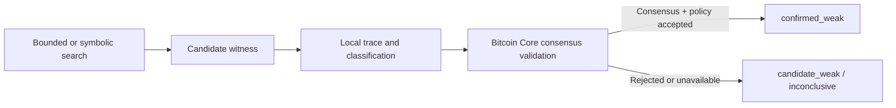

# Detection model and limitations

## Definition of a candidate weak script

For this project, a revealed TapScript is a candidate weakness when the bounded
analyzer finds an initial witness stack that:

1. reaches a successful final stack;
2. does not require a valid signature;
3. can be represented as concrete witness items;
4. produces a replayable execution trace.

This is intentionally narrower than every possible script vulnerability. The
project currently focuses on unauthorized-looking signatureless satisfaction,
`OP_SUCCESSx`, and upgradeable public-key behavior.

## Evidence chain

A risk report is based on the following chain of evidence:

1. A confirmed transaction spends a locally tracked P2TR output.
2. Its witness reveals a script and control block.
3. The scanner verifies that the control block commits the script to the spent
   output key.
4. The analyzer generates a candidate signatureless witness.
5. When enabled, a synthetic equivalent is evaluated by Bitcoin Core
   `testmempoolaccept` on isolated regtest.
6. The database finds one or more currently unspent outputs with the same
   output key.

The report includes:

- output key;
- current balance and outpoints;
- vulnerable script;
- vulnerability class;
- proof witness;
- proof strategy;
- execution trace;
- first revealing transaction;
- analyzer limitations.

The commitment proof shows that the revealed leaf belongs to the output. A
local witness remains `candidate_weak`; acceptance by the isolated Bitcoin Core
validator promotes it to `confirmed_weak`.

## Search space

The analyzer runs three bounded strategies in order. It returns the first
candidate that succeeds in the custom executor and records that strategy with
the proof.

### Boolean exhaustive search

For a configured maximum depth `n`, this strategy searches every combination of
empty and minimally true (`01`) items at depths `0..n`. The implementation caps
`n` at 12.

This strategy is well suited to mistakes such as:

- a failed signature check whose false result is discarded or bypassed;
- an independent true value surviving to the final stack;
- conditional branches whose stack effects were misunderstood;
- simple stack-manipulation errors.

### Small numbers and script constants

The second strategy adds:

- negative zero as a false boolean atom;
- minimally encoded `-1` and integers `2` through `16`;
- up to eight unique values, no larger than 520 bytes, pushed by the script.

It searches combinations only through `min(n, 3)` witness items. Script-derived
atoms can discover paths that require the same byte string as an already-pushed
constant, but they do not recover unknown preimages.

### Observed signature removal

During chain scanning, BIP 341 commitment parsing provides the verified
TapScript initial stack after removing the optional annex, script, and control
block. The analyzer treats 64- and 65-byte items as signature-shaped and tries:

- emptying each such item individually;
- removing each such item individually;
- emptying all such items together;
- removing all such items together.

Candidates that still exceed the configured witness-item limit are skipped.
The strategy does not enumerate every mixed subset of empty/remove
transformations. Length is only a heuristic for generating candidates; it does
not prove that the observed item was a valid signature.

The standalone `analyze-script` command does not receive an observed transaction
witness, so this strategy has no candidates there.

### Persisted search coverage

For each analysis the database records the requested and effective boolean
depth, rich-search depth, strategy names, atom limits, observed-witness source,
signature-shaped lengths, and transformations. It does not store a list of
every dynamically generated candidate or script-derived atom.

The combined bounded search can still miss satisfactions requiring:

- hashes or preimages;
- byte strings that are neither selected script constants nor retained observed
  stack items;
- encoded numbers outside the small set unless the script pushes them;
- locktime or sequence values;
- larger or structured witnesses outside the configured depths;
- mixed observed-signature transformations not listed above.

## Status semantics

The analyzer's internal `weak` status is mapped into one of these persisted
detection statuses:

### `confirmed_weak`

A synthetic equivalent passed Bitcoin Core consensus checks and current mempool
policy under `testmempoolaccept`.

### `candidate_weak`

The analyzer found a candidate, but Core validation was not requested, failed,
or returned a generic rejection. Because `testmempoolaccept` combines consensus
and policy, a generic rejection leaves both layers inconclusive unless
additional evidence separates them.

A persisted candidate is not downgraded merely because a later run uses a
smaller search bound or otherwise fails to rediscover its proof. A later
candidate refreshes the proof and matching search metadata together, while an
authoritative validation may promote it to `confirmed_weak`. Once confirmed,
later local candidate generation does not replace its authoritative evidence.

### `no_proof_found`

No candidate was found in the bounded witness search.

The scanner persists the TapLeaf hash, original script size, chain provenance,
analyzer version, and search configuration for this result, but compacts the
full script and observed witness. Re-analysis with a future analyzer therefore
requires fetching the revealing block again.

It must never be interpreted as:

- safe;
- signature-secured;
- exhaustively analyzed;
- free from other classes of vulnerability.

### `inconclusive`

At least one explored path reached unsupported semantics. Examples currently
include operations such as `OP_CHECKLOCKTIMEVERIFY` and
`OP_CHECKSEQUENCEVERIFY`.

Other explored candidates may still have failed normally, but the analyzer
cannot close the search space.

### `invalid_script`

The analyzer could not parse the script. For a script already accepted in a
confirmed `0xc0` script-path spend, this status would indicate a scanner defect
or model mismatch and should be investigated.

## Vulnerability classes

| Class | Meaning |
| --- | --- |
| `signatureless_satisfaction` | The modeled script succeeds without a valid signature. |
| `op_success_unconditional` | `OP_SUCCESSx` succeeds under current consensus rules, subject to policy and future soft forks. |
| `upgradable_pubkey_type` | A non-empty signature succeeds for an unknown public-key type, subject to policy and future soft forks. |

The latter two classes need especially careful communication: consensus
validity, standard relay policy, and future soft-fork behavior are distinct.

Every retained weakness also stores `proof_strategy`. Databases created before
that field existed are migrated with `legacy_unspecified`; this label means the
historical strategy is unknown, not that the proof was regenerated.

## Current semantic gaps

The custom executor is intentionally incomplete. Before it can support
high-confidence public findings, it needs:

- complete minimal-number-encoding behavior;
- signature-operation budget accounting;
- transaction-context handling for locktime and sequence checks;
- complete resource-limit and failure semantics;
- differential tests against Bitcoin Core;
- BIP 342 and Bitcoin Core test-vector coverage;
- property tests or fuzzing for parser and stack behavior.

The safest mature architecture is:

The custom engine remains valuable for generation, pruning, explanations, and
traces. Bitcoin Core supplies the final validity decision.

## Hidden-script limitation

The most important coverage limitation is not an implementation bug; it follows
from Taproot's design.

Before a script-path spend, the chain exposes only the Taproot output key. The
scanner cannot determine:

- whether a script tree exists;
- how many leaves it contains;
- what any leaf contains;
- whether a hidden leaf is weak.

Consequently, the scanner can discover an at-risk unspent output only after it
has learned the committed weak leaf from some source. The current source is a
prior on-chain revelation using the same output key.

Future off-chain evidence adapters could accept:

- output descriptors;
- wallet source-code templates;
- known script trees;
- reproducible wallet-generation parameters;
- responsibly disclosed control blocks and scripts.

Those inputs must remain provenance-labelled and must never be confused with
facts inferred from the chain alone.

## False-positive risks

A `candidate_weak` may be a false positive if:

- the custom executor diverges from BIP 342 or Bitcoin Core;
- a required resource limit is not modeled;
- number encoding is accepted more loosely than consensus;
- upgradeable behavior is described without its relay-policy constraints;
- local chain state is stale.

`confirmed_weak` substantially reduces executor-divergence false positives, but
still describes only the synthetic script-path reproduction. It does not prove
ownership, intent, current availability of a real output, or safety of any
operational response.

## False-negative risks

A weak script may be missed if:

- it has never been revealed;
- its output key is not reused;
- its witness requires atoms outside all configured strategies;
- its boolean proof requires more than 12 witness items;
- its rich-atom proof requires more than three witness items;
- it requires an unsearched mixture of observed signature removals and
  emptyings;
- execution reaches an unsupported opcode;
- the scan begins after creation of relevant P2TR outputs;
- the node or scan database does not cover the canonical history completely.

Every report consumer should evaluate both lists before acting on a result.
